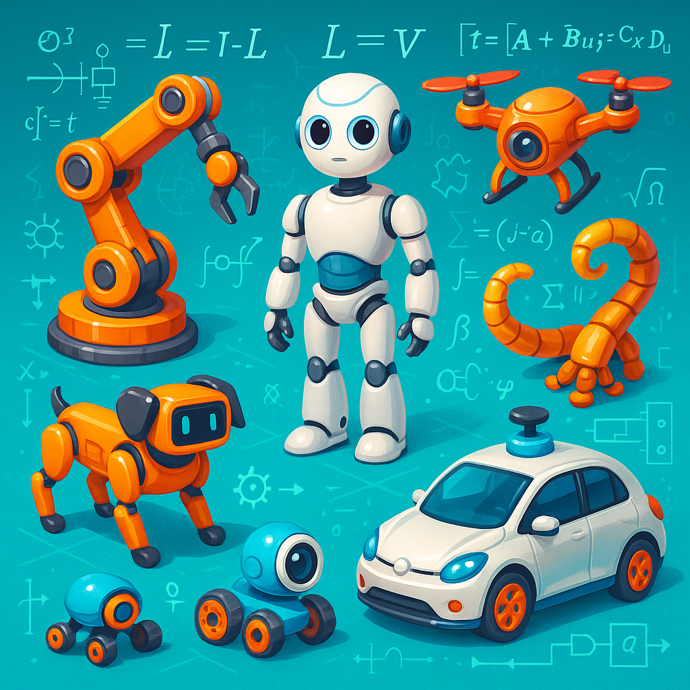

# ROB701 Introduction to Robotics

| Date       | Topic                                 | Notices                                                                                        |
| ---------- | ------------------------------------- | ---------------------------------------------------------------------------------------------- |
| 2025-10-09 | Forward and Inverse Kinematics        |                                                                                                |
| 2025-10-16 | Lagrange Dynamics                     | The 3R robot lies in a vertical plane, so you must account for gravity in your implementation. |
| 2025-10-23 | Project: System identification        |                                                                                                |
| 2025-10-30 | Trajectory tracking control           |                                                                                                |
| 2025-11-06 | 3R planar robot trajectory generation |                                                                                                |
| ...        | ...                                   |                                                                                                |